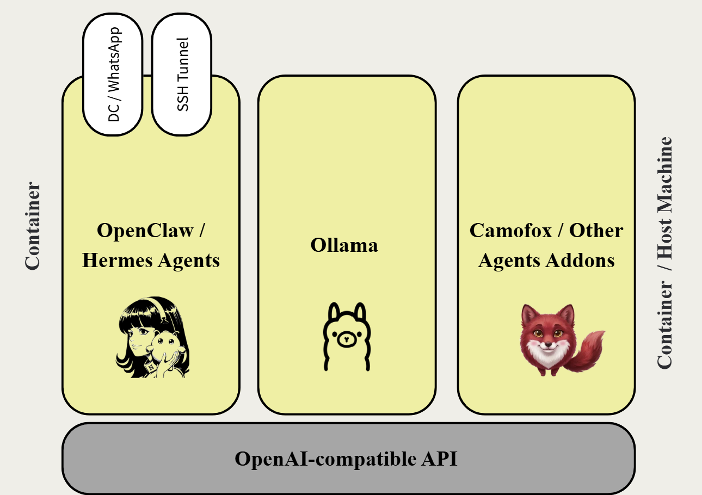

# Hermes Agent — Self-Hosted Docker Stack

A four-container Docker stack that runs the [Hermes Agent](https://hermes-agent.nousresearch.com)
entirely on your own hardware: local GPU inference, a stealth browser for the agent's
web tools, and a container dashboard — with the agent itself sealed off from the host.

No cloud LLM keys required. The agent talks to a local Ollama server over an
OpenAI-compatible API, so nothing leaves the machine unless you configure it to.



---

## What's in the box

| Container | Role | Exposed on |
|---|---|---|
| **hermes-agent** | The agent. Ubuntu 24.04 + CUDA, SSH access, Hermes CLI + gateway | SSH, `127.0.0.1:22022` by default |
| **hermes-ollama** | GPU inference backend, OpenAI-compatible API | `127.0.0.1:11434` |
| **hermes-camofox** | [Camofox](https://github.com/jo-inc/camofox-browser) browser server for the agent's browsing tools | `127.0.0.1:9377`, noVNC on `6080` |
| **hermes-portainer** | Container dashboard | `https://127.0.0.1:9443` |

The agent reaches Ollama and Camofox by service name over a private Docker
network. Only the ports above touch the host, and all of them default to
loopback.

### Why it's built this way

- **The agent runs arbitrary code.** It has terminal and browser tools, and it
  acts on text from the internet and from chat platforms. It is treated as
  untrusted throughout.
- **Inference is separated from the agent.** Ollama is its own container, so you
  can restart, swap models, or replace it (with vLLM, say) without touching the
  agent.
- **Browsing goes through Camofox** rather than a cloud browser service, so page
  fetches originate from your machine and need no third-party API key.

---

## Requirements

- Linux host (developed on Ubuntu 24.04)
- NVIDIA GPU + driver — **550 or newer**; recent Ollama images refuse older drivers
  and silently fall back to CPU
- Docker Engine + Compose plugin, NVIDIA Container Toolkit — `install-prereqs.sh`
  installs both
- ~40 GB disk for images and model weights

GPU is strongly recommended but not mandatory: set `GPU_COUNT=0` for CPU-only
inference (slow).

---

## Quick start

```bash
git clone <your-fork-url> hermes-stack
cd hermes-stack

# 1. Host prerequisites: Docker, NVIDIA Container Toolkit, firewall rule.
#    Read it before running — it installs packages and iptables rules.
sudo ./install-prereqs.sh
newgrp docker                  # or log out and back in

# 2. Configuration. THIS STEP IS REQUIRED — the stack will not start without it.
cp .env.example .env
chmod 600 .env
nano .env                      # fill in every "CHANGE ME"

# 3. Build and launch. First build is long (CUDA image + Camofox Firefox bundle).
docker compose up -d --build
docker compose ps              # ollama and camofox should report (healthy)
```

Then pull a model and use the agent:

```bash
docker compose exec ollama ollama pull qwen3.5:9b

ssh root@localhost -p 22022    # password = SSH_PASSWORD from .env
  hermes model                 # select the local Ollama provider
  hermes                       # interactive agent
```

### Generating the secrets

`.env` needs four values. Generate them:

```bash
echo "SSH_PASSWORD=$(openssl rand -base64 24 | tr -d '/+=' | head -c 28)"
echo "CAMOFOX_API_KEY=$(openssl rand -hex 32)"
echo "CAMOFOX_ADMIN_KEY=$(openssl rand -hex 32)"
echo "VNC_PASSWORD=$(openssl rand -base64 18 | tr -d '/+=' | head -c 20)"
```

Compose fails fast with a named error if any are missing.

---

## Configuration

Everything tunable is in `.env`. The table below covers what most people change.

### Must change

| Variable | Purpose |
|---|---|
| `SSH_PASSWORD` | Root password for SSH into the agent container |
| `CAMOFOX_API_KEY` / `CAMOFOX_ADMIN_KEY` | Camofox server auth |
| `VNC_PASSWORD` | Camofox noVNC live-view password |

### Commonly changed

| Variable | Default | Notes |
|---|---|---|
| `SSH_PORT` | `22022` | Host port forwarded to the container's sshd |
| `SSH_BIND` | `127.0.0.1` | `0.0.0.0` exposes SSH to your LAN — **read Security first** |
| `RESTART_POLICY` | `no` | `unless-stopped` makes the stack survive reboots |
| `GPU_COUNT` | `all` | `all`, an integer, or `0` for CPU-only |
| `CUDA_IMAGE` | `nvidia/cuda:12.6.3-devel-ubuntu24.04` | Must match your driver — see below |
| `OLLAMA_SCHED_SPREAD` | `0` | `1` to split one model across every GPU |
| `AGENT_MEM_LIMIT` | `16g` | Keep below total system RAM |

Port and subnet overrides (`OLLAMA_PORT`, `HERMES_SUBNET`, …) are documented
inline in `.env.example`. If you change `HERMES_SUBNET` or `HERMES_GATEWAY`,
re-run `install-prereqs.sh` so the host-isolation firewall rule is rewritten to
match — the script reads those values straight out of `.env`.

### CUDA image vs driver

Pick a `CUDA_IMAGE` your driver supports. Check with `nvidia-smi`:

| CUDA major | Minimum driver |
|---|---|
| 12.x | 525 |
| 13.x | 580 |

`12.6.3` is the lowest CUDA tag NVIDIA publishes for `ubuntu24.04`. Choosing a
CUDA major newer than your driver supports makes the GPU invisible inside the
container. Note this only affects your own GPU work in the agent container —
Ollama bundles its own CUDA runtime and is unaffected.

---

## GPU configuration

`GPU_COUNT=all` passes through every GPU the host has, so **this works unchanged
on 1, 2, 4 or 8 cards**. The only setting that depends on GPU count is
`OLLAMA_SCHED_SPREAD`:

| Your hardware | `OLLAMA_SCHED_SPREAD` | Why |
|---|---|---|
| Single GPU | `0` | Nothing to spread |
| Multi-GPU, model fits on one card | `0` | Packing onto one card avoids PCIe traffic — faster |
| Multi-GPU, model too big for one card | `1` | Required, or the model spills to CPU |

To decide, compare your model's resident size against **one card's** VRAM:

```bash
docker compose exec ollama ollama ps    # SIZE column, and PROCESSOR
```

If `PROCESSOR` shows any CPU percentage, the model didn't fit — set
`OLLAMA_SCHED_SPREAD=1`, or use a smaller model or shorter context.

Remember the KV cache counts, and at long context it can exceed the weights.
A 27B model at 4-bit is ~17 GB of weights, but ~38 GB resident at a 256K
context window.

Set `OLLAMA_FLASH_ATTENTION=0` on Turing (RTX 20xx) or older; leave it `1` on
Ampere (RTX 30xx) and newer for a significant KV-cache saving at long context.

### Reference setup

This stack was developed and run on:

- 2× NVIDIA RTX 3090 (24 GB each, 48 GB total), no NVLink
- Ubuntu 24.04, driver 580, CUDA 13 capable
- 30 GB system RAM
- `qwen3.5:27b` at a 256K context window, spread across both cards
  (`OLLAMA_SCHED_SPREAD=1`, ~38 GB resident, 100% GPU)

---

## Security

The agent container is deliberately isolated from the host:

- **No host filesystem.** `/root/.hermes` and `/workspace` are named volumes, not
  bind mounts. Nothing from your home directory is visible inside.
- **No Docker socket.** Only Portainer gets it, read-only, and Portainer sits
  alone on a second network the agent isn't attached to.
- **No host aliasing.** No `network_mode: host`, no `host.docker.internal`.
- **No privilege escalation.** `no-new-privileges`, `cap_drop: ALL` with only the
  capabilities sshd and fail2ban need added back. Never `privileged`.
- **Host gateway blocked.** `install-prereqs.sh` adds `DOCKER-USER` and `INPUT`
  iptables rules dropping traffic from the agent subnet to the host, while
  leaving outbound internet working.

Move files in and out with:

```bash
docker compose cp ./file hermes-agent:/workspace/
docker compose cp hermes-agent:/workspace/result.txt ./
```

### Before exposing SSH

`SSH_BIND` defaults to `127.0.0.1`. Setting it to `0.0.0.0` — and especially
port-forwarding at a router — puts a **root shell with password auth** on your
network. The container is isolated from the host, but the container itself has
your API keys and outbound internet.

If you expose it, switch to key auth first:

```bash
docker compose exec hermes-agent sh -c 'mkdir -p /root/.ssh && chmod 700 /root/.ssh'
docker compose cp ~/.ssh/id_ed25519.pub hermes-agent:/root/.ssh/authorized_keys
# then set PasswordAuthentication no in hermes/Dockerfile's sshd drop-in, rebuild
```

fail2ban runs inside the container (3 failures in 10 min → 1 hour ban):

```bash
docker compose exec hermes-agent fail2ban-client status sshd
```

### If you use the Discord/Telegram gateway

`DISCORD_ALLOW_ALL_USERS=true` (or the equivalent for other platforms) lets
**anyone** who can message the bot drive an agent with terminal and browser
tools. Prefer an allowlist — `DISCORD_ALLOWED_USERS`, or `DISCORD_ALLOWED_CHANNELS`
to keep it open but confined to nominated channels.

---

## Operating the gateway

`hermes gateway` (Discord, Telegram, Slack, cron) is started automatically at
container boot by a supervisor that restarts it if it dies — including when
someone tells the agent to kill it.

```bash
docker compose exec hermes-agent gw status     # supervisor + gateway pids
docker compose exec hermes-agent gw log        # follow the log
docker compose exec hermes-agent gw restart
docker compose exec hermes-agent gw stop       # stop AND disable (survives restarts)
docker compose exec hermes-agent gw start      # re-enable
```

Don't run `hermes gateway` by hand as well — the supervisor already owns it, and
two instances mean duplicate replies. Use `gw stop` rather than `pkill` when you
genuinely want it down; a bare `pkill` is now just a restart.

---

## Browser configuration

The agent's browsing tools are wired to Camofox on first boot. If you re-run
`hermes setup`, it rewrites `~/.hermes/config.yaml` and drops this — restore it
with:

```yaml
browser:
  cloud_provider: camofox        # required; CAMOFOX_URL alone does not select it
  camofox:
    managed_persistence: true    # must be under browser.camofox, not top-level
    rewrite_loopback_urls: true
    loopback_host_alias: hermes-agent
```

and `CAMOFOX_URL=http://camofox:9377` in `~/.hermes/.env`.

> The upstream docs suggest `loopback_host_alias: host.docker.internal`. That
> points at your **host machine** and would defeat the isolation above. Point it
> at `hermes-agent` instead.

Note `web_search` and the browser are different tools — a search query returns
API results and never opens a browser. To exercise Camofox, ask the agent to
*visit* a page, and watch `docker compose logs -f camofox` for `tab created`.

---

## Everyday commands

```bash
docker compose ps                          # status
docker compose logs -f hermes-agent        # agent + sshd
docker compose logs -f camofox             # browsing activity
docker compose restart hermes-agent
docker compose down                        # stop; volumes survive
docker compose down -v                     # stop AND delete all data. careful.
docker compose up -d --build hermes-agent  # rebuild just the agent
```

Persistent state lives in Docker volumes: `hermes_home` (config, sessions,
memories), `hermes_workspace`, `ollama_models`, `camofox_data`,
`portainer_data`. `docker compose down` keeps them; `down -v` destroys them.

---

## Repository layout

```
.
├── docker-compose.yml      # the four services, networks, volumes
├── .env.example            # every tunable, documented — copy to .env
├── install-prereqs.sh      # Docker + NVIDIA toolkit + host-isolation firewall
├── upgrade-driver.sh       # NVIDIA driver upgrade helper (for the 550+ requirement)
├── assets/Setup.png        # architecture diagram
└── hermes/
    ├── Dockerfile          # the agent image
    ├── entrypoint.sh       # per-boot setup, seeds config, starts services
    ├── gw-supervisor.sh    # keeps `hermes gateway` alive
    └── gw                  # gateway control CLI
```

---

## Troubleshooting

**`ollama ps` says `100% CPU`** — driver older than 550. Check
`docker compose logs ollama | grep -i "driver too old"`, then run
`sudo ./upgrade-driver.sh` and reboot.

**`permission denied ... /var/run/docker.sock`** — your shell predates the
docker group change. Run `newgrp docker` or log out and back in.

**Ollama install fails during build with a zstd error** — the base image lacks
`zstd`. It's in the apt list; if you changed `CUDA_IMAGE`, make sure it's still
installed.

**Camofox build fails** — it builds from the upstream git URL using
`Dockerfile.ci`. The repo's default `Dockerfile` will not work here; it needs
binaries pre-fetched into `dist/` via bind mounts.

**Agent can't reach the model** — from inside the container,
`curl -s http://ollama:11434/v1/models` should return JSON. If not, check
`docker compose ps` shows ollama healthy.

---

## Credits

- [Hermes Agent](https://hermes-agent.nousresearch.com) — Nous Research
- [Camofox](https://github.com/jo-inc/camofox-browser) — jo-inc
- [Ollama](https://ollama.com), [Portainer](https://portainer.io)
